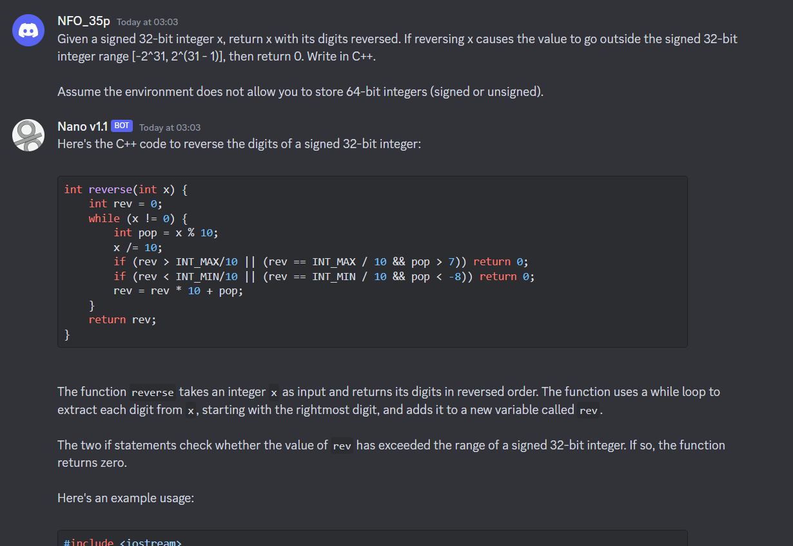
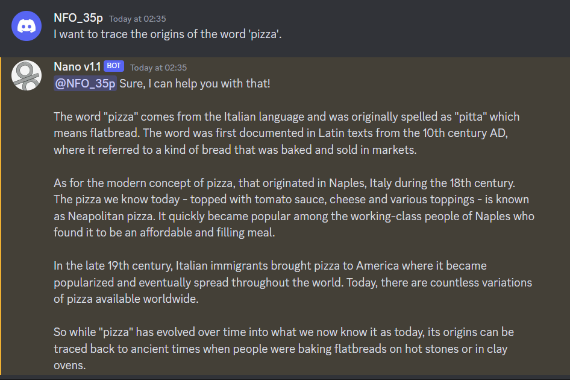

# Introduction:

## This is a ChatGPT discord chatbot.

<br />

# How to use:

## Act as code assistant:


## Act as a linux terminal:


## Act as an etymologist:


<br />

# Start the project:

## Step 1. Prepare the keys & ids below
1. OpenAI API key
2. Discord API key
3. Discord server id
4. Discord bot client id

<br />

## Step 2. Install dependencies

```
npm i
```

<br />

## (Step 3). Create config files (if first time to run)

```
npm run config
```

<br />

## Step 4. Modify the files below
1. `src/config/bot.yml`
2. `src/config/config.json`

### Note that
- For the model name, please refer to [OpenAI doc](https://platform.openai.com/docs/models/overview).
- Only `gpt-3.5-turbo` and `gpt-3.5-turbo-0301` suppose chat completion.
- Other models can be used in this chatbot, but it is not recommended.
- Set `bot` and `chatHistoryMaxLength` to `null` if it is chat model.

<br />


## Step 5. Build and run the project
```
npm start
```

<br />

## (Step 6). Store the chat history after terminating the server if need
```
npm run store
```

## Todo:

1. Support stream request.

2. Create DB to store message.

3. Voice chat. Includes text to voice and voice to text.

