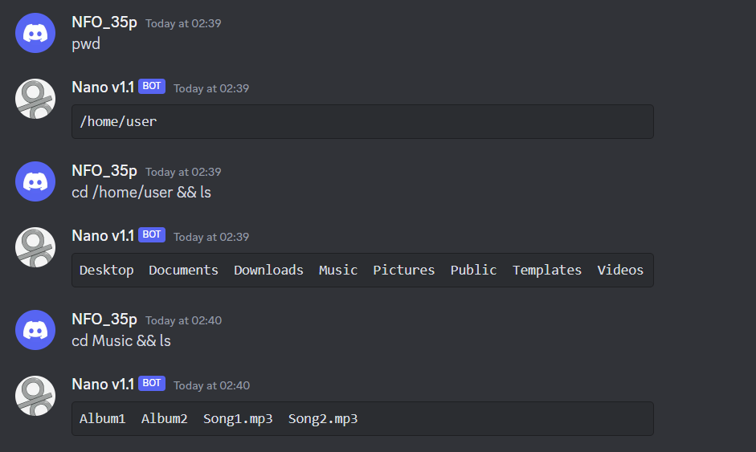

# Introduction:

This is a ChatGPT discord chatbot with bot role configuration.

<br />

# How to use:

1. Config the bots (details in step 4)

2. Talk to them or type commands

Act as code assistant:


Act as a linux terminal:



Act as an etymologist:


<br />

# Bot Commands
- `/intro` Show the which basic functions of the bot of current channel
- `/reset` Clean the chat history of current channel (only available in chat model)
- `/model-setting` Show the model setting of the bot of current channel
- `/channel-setting` Show the channel setting of the bot of current channel
- `/source-code` Show the the URL of this repo

<br />

# Start the project:

## Step 1. Prepare the keys & ids below
- OpenAI API key
- Discord API key
- Discord server id
- Discord bot client id

<br />

## Step 2. Install dependencies

```
npm i
```

<br />

## (Step 3). Create config files (if first time to run)

```
npm run config
```

<br />

## Step 4. Modify the files below to config the role, personality, and function of bots in different channels.
1. `src/config/bot.yml`
2. `src/config/config.json`

### Note
- For the model name, please refer to [OpenAI doc](https://platform.openai.com/docs/models/overview).
- Only `gpt-3.5-turbo` and `gpt-3.5-turbo-0301` suppose chat completion.
- Other models can be used in this chatbot, but it is not recommended.
- Set `chatHistoryMaxLength` smaller than 2000 due to openAI API limitation.
- Set `bot` and `chatHistoryMaxLength` to `null` if it is chat model.
- For the detail setting, please refer to [OpenAI doc](https://platform.openai.com/docs/api-reference/parameter-details).

<br />


## Step 5. Build and run the project

<br />

#### For Windows
```
npm start
```

#### For Linux
```
npm run start-linux
```

<br />

## (Step 6). Store the chat history after terminating the server if need

<br />

#### For Windows
```
npm run store
```

#### For Linux
```
npm run store-linux
```

## Todo:

1. Support stream request.

2. Create DB to store message.

3. Voice chat. Includes text to voice and voice to text.

